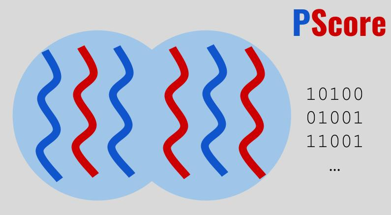
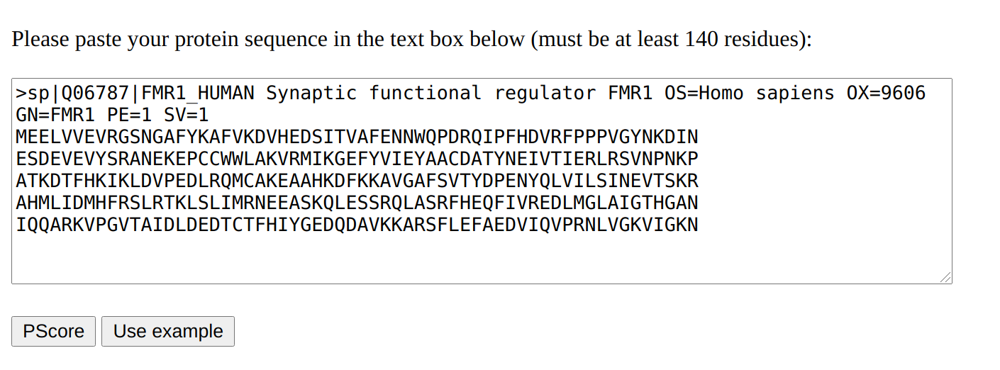
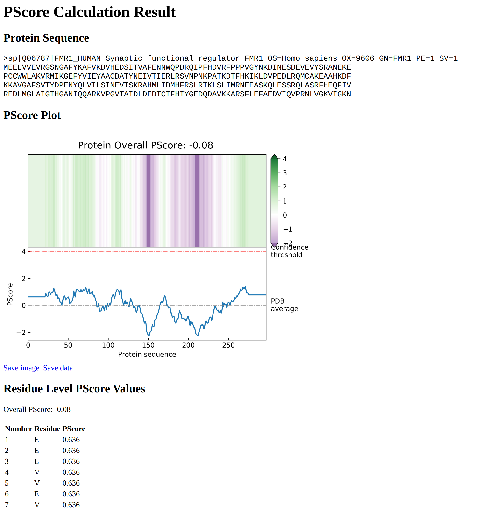

This repo contains the source code for [PScore](http://pound.med.utoronto.ca/~JFKlab/Software/psp.htm) (online version), a bioinformatics tool that predicts protein phase separation behavior, developed by [JFK laboratory](http://pound.med.utoronto.ca/~JFKlab/index.php) at University of Toronto.

# PScore - online version
`PScore` is a bioinformatic tool that predicts the likelihood of intrinsically disordered protein regions (IDRs) to phase separate based on propensity for long-range planar pi-pi contacts.

## Introduction - Protein phase separation
Protein phase separation is a process by which a well-mixed solution of  proteins spontaneously separates into two phases: a dense and a dilute phase. It is known to play a role in a variety of cellular processes, including formation of classical membraneless organelles, signaling complexes, the cytoskeleton, and numerous other supramolecular assemblies. It is also known to have associations with a variety of neurological diseases, including Alzheimer's disease, Parkinson's disease, etc. In order to better understand biology and treat these diseases, it is essential to develop bioinformatic algorithms to predict protein phase separation from sequence. 

## PScore: A machine learning prediction algorithm
`PScore` is a machine learning algorithm that predicts the likelihood of protein phase separation based on propensity for long-range planar pi-pi contacts. We built and trained a machine learning model using 1,000,000+ Pi-Pi interactions of 10,000+ protein structures in [Protein Data Bank](https://www.rcsb.org/).

 The algorithm returns a single score per sequence supplied in fasta sequence format, ignoring sequences that are shorter 140 residues (shorter than any sequence in the training/test set) or that have ambigious residues (outside the scope of the training process). This predictor was designed primarily with the goal of testing the relationship between planar pi-pi contacts and IDR phase separation, but validation of the predictor demonstrates that it discriminates known phase-separating IDR-containing proteins from other protein sequences.

For use in predicting sequences note that the contact predictions and validation tests both derive primarily from sequences found in nature, and the supported use of this program is in highlighting full sequences as found in proteomic datasets. Scores for artificial sequences and for arbitrary segments of proteins represent untested extrapolations.

## Usage example
- Paste or input protein sequence in the text box:

- Click **`PScore`** and view results in the new window:  
 

## Standalone offline version
- Download offline version here: [PScore-offline](http://abragam.med.utoronto.ca/~JFKlab/Software/Download/elife-31486-code2-v2.tgz).

## Reference
- [Vernon, Robert McCoy, et al. "Pi-Pi contacts are an overlooked protein feature relevant to phase separation." elife 7 (2018): e31486.](https://elifesciences.org/articles/31486)

## Disclaimer and Authorship
- Copyright of all materials in this repository belongs to JFK laboratory and University of Toronto, and can only be used or distributed for educational and research purpose. You may not use or distribute them for commercial purposes.
- For any use of PScore in educational and research context, please cite this paper: "Vernon RM, Chong PA, Tsang B, Kim TH, Bah A, Farber P, Lin H, Forman-Kay JD. Pi-Pi contacts are an overlooked protein feature relevant to phase separation. elife. 2018 Feb 9;7:e31486".
- The core algorithm of `PScore` is developed by [Dr. Robert M. Vernon](https://www.researchgate.net/profile/Robert-Vernon-3).
- `PScore-online` is developed by [Dr. Hao Cai](https://ca.linkedin.com/in/haocai1992), including server setup, model deployment and website building